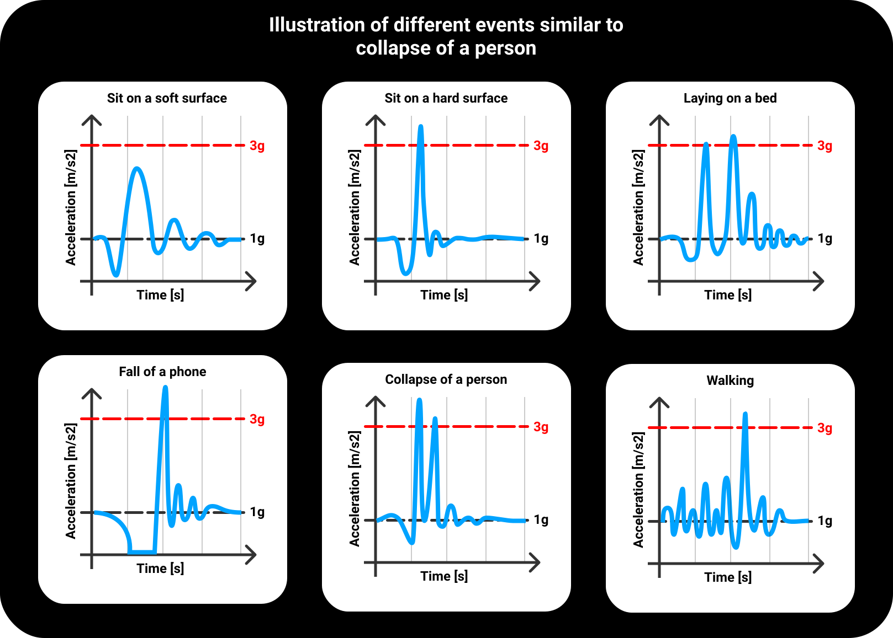

# BeSafeBox - research

[](https://www.python.org/downloads/release/python-379/)
[](https://github.com/python/black)
[](https://www.gnu.org/licenses/gpl-3.0)

This part of the project, tries to research the subject of the fall/collapse detection and provide 
an easy solution. The model uses hand-made features of a statistical character, which are 
passed to traditional machine learning models like SVM or RandomForest.



## Results of the model
The final model consists of only 5 features extracted from region of interest, which 
is a marked region with a high amplitude. These features are enough to achieve average 
**accuracy of 90.5 %** with the dataset of 3260 simulated events similar to fall (fall, sit, lay, walk).
For the fall alone, the **precision is 78 % and recall 90,5 % in average**. 

The data were gathered by custom phone app, 
[SensorBox, available at Google Play](https://play.google.com/store/apps/details?id=motionapps.sensorbox),
with usage of 2 different phones, which were placed in a pocket of trousers, jeans, shirt or jacket.

### [You can check SensorBox repository here](https://github.com/Foxpace/SensorBox)
### [For Android app of BeSafeBox implementation go here](https://github.com/Foxpace/BeSafeBox_Android_app)

## Real life testing
False positivity was tested at almost 300h of acceleration data from real life, which resulted in more
than 4000 indications of the falls. **1.53 % of the events led to a false alarm.** It has to 
be taken into account, that the **measurements were done by young people, who went to a gym and lived active life**, 
so some events will always resemble fall due to character of the movement. If we wanted to resolve the problem, 
we would have to take into account whole context of a person, which was not part of the research.

## Android testing 
#### (with deprecated approach)
The android app put into a test older version of the model with accuracy of 
86% and sensitivity of 76 %. In total, the app was used for 520h, when the algorithm captured
13 151 indications for the fall and only 576 of them were passed to the model itself because of mechanisms to 
prevent an overuse of the model (like a high activity of the person / fall of the phone itself). Only 94 of 576 of the 
indications resulted into false alarm, which is 16 % false positivity. Users reported, that the most of the events 
occurred while high physical activity, or they slammed themselves on the couch / bed.

### For more info check [Research.ipynb](https://github.com/Foxpace/BeSafeBox_research/blob/master/Research.ipynb)


## Structure of the project

* **Consts.py** - constants, which are used in the project
* **DataCarrier.py** - basic object, which can process the data from former versions of the SensorBox
* **EventChecker.py** - extracts the event of interest from measurement and checks validity of the measurement
* **IQRCleaning.py** - IQR rule used to clean the dataset 
* **Parameters.py** - all parameters created / gathered from literature - check for resources
* **Research.ipynb** - whole research with steps and description 

## Used libraries

* [NumPy](https://numpy.org/doc/stable/contents.html) - 1.20.1
* [Pandas](https://pandas.pydata.org/docs/index.html) - 1.2.3
* [Matplotlib](https://matplotlib.org/stable/index.html) - 3.3.3
* [Seaborn](https://seaborn.pydata.org/#) - 0.11.1
* [Scikit-learn](https://scikit-learn.org/stable/index.html) - 0.24.1
* [LOFO - importance](https://github.com/aerdem4/lofo-importance) - 0.2.6 - leave one out feature importance
* [tqdm](https://github.com/tqdm/tqdm) - 4.59.0 -  progress bar
* [sklearn-porter](https://github.com/nok/sklearn-porter) - 0.7.4 - 
Transpile trained scikit-learn estimators to C, Java, JavaScript and others.
* [NumBa](https://numba.pydata.org/) - 0.53.0 -
JIT compiler that translates a subset of Python and NumPy code into fast machine code
* [bayes_opt](https://github.com/fmfn/BayesianOptimization) - 1.2.0 - Bayesian optimization algorithm


## To cite this work - BibTeX


```
@thesis{Repcik2019,
author = {Rep{\v{c}}{\'{i}}k, Tom{\'{a}}{\v{s}}},
title = {{Detection of car accident and collapse by Android smartphone}},
keywords = {Android,Collapse,Java,Python,car accident,machine learning,neural network},
pages = {72},
publisher = {Brno University of Technology. Faculty of Electrical Engineering and Communication},
school = {Brno University of Technology},
type = {Bachelor's Thesis},
url = {http://dspace.lib.vutbr.cz/xmlui/handle/11012/173624},
month = {june},
year = {2019}
}
```


## Resources used in code
**1.**
**authors:** SANTOYO-RAMÓN, José Antonio, Eduardo CASILARI and José Manue CANO-GARCÍA\
**work:** _Analysis of a smartphone-based architecture with multiple mobility sensors for fall detection with
supervised learning._\
**DOI:** [doi:10.3390/s18041155](https://doi.org/10.3390/s18041155)

**2.**
**authors:** FIGUEIREDO, Isabel N., Carlos LEAL, Luís PINTO, Jason BOLITO a André LEMOS.\
**work:** Exploring smartphone sensors for fall detection\
**DOI**: [doi:10.1186/s13678-016-0004-1](https://doi.org/10.1186/s13678-016-0004-1)
 
**3.**
**authors:** ABBATE, Stefano, Marco AVVENUTI, Guglielmo COLA, Paolo CORSINI, Janet LIGHT a Alessio VECCHIO.\
**work:** Recognition of false alarms in fall detection systems\
**DOI:** [doi:10.1109/CCNC.2011.5766464](https://doi.org/10.1109/CCNC.2011.5766464)

**4.**
**author:** HJORT, Bo\
**work:** EEG Analysis Based On Time Domain Properties\
**DOI:** [doi:10.1016/0013-4694(70)90143-4](https://doi.org/10.1016/0013-4694(70)90143-4)

**5.**
**author:** MARAGOS, P., J.F. KAISER a T.F. QUATIERI\
**work:** On amplitude and frequency demodulation using energy operators\
**DOI:** [doi:10.1109/78.212729](https://doi.org/10.1109/78.212729)
